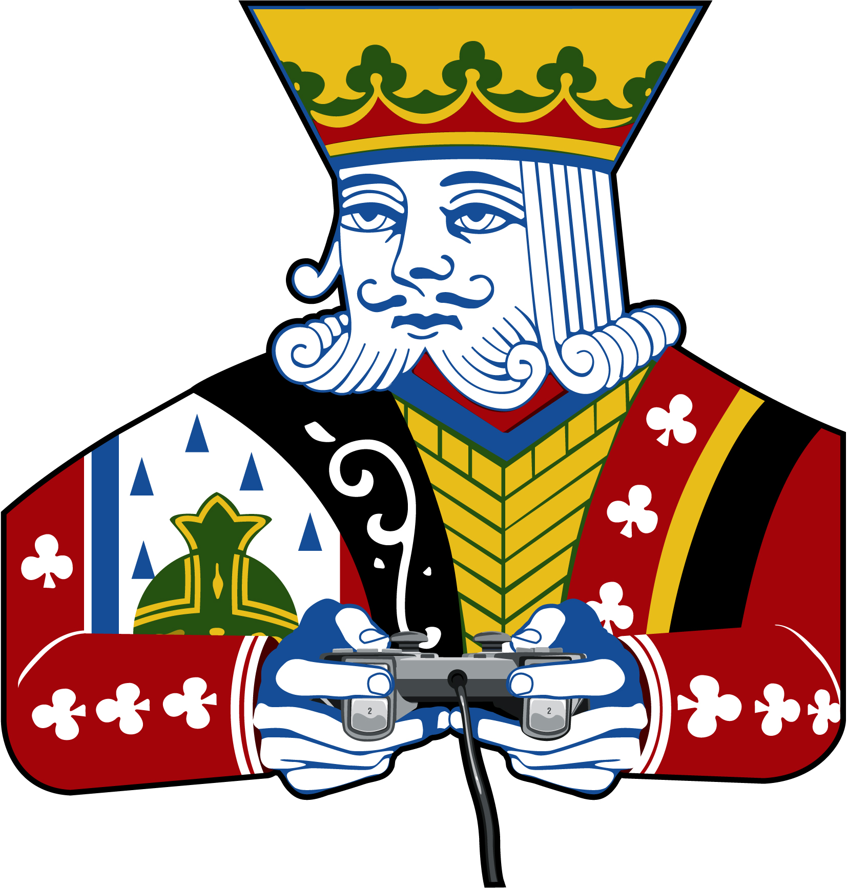

# Game Tables

  

In this project I use React.js 18 allong with react-router 6 to tie in five different games. I use MUI 5 for styling and practice positioning with the Grid component.

Open [Game Tables](https://gametables.netlify.app/) to view it in your browser.

## 🧐 What's inside?

A quick look at the sections you'll see in this React project.

1.  **`Hi Low:`**

2.  **`Five Card Stud:`**

3.  **`Craps:`**

4.  **`Poker Dice:`**

5.  **`Yahtzee:`**

 
 
<h2 align="center">
  &copy; 2022 Michael Saucedo
</h2>
